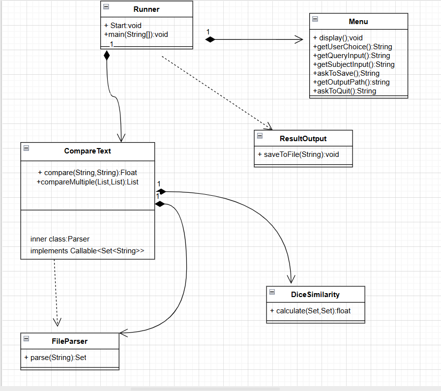

# Text-Similarity-Comparison-Application

## Description
This is a console-based application that allows users to compare local.txt files and calculate how similar they are to eachother. The application reads text documents, breaks them down into individual words,uses the Sørensen-Dice algorithm to determine what percentage of words are shared between the files, making it useful for plagiarism detection, version comparison, or content verification. 
Users interact with the application through a simple menu-driven interface where they can enter file paths for query and subject documents, run the comparison process, and view the similarity results displayed as percentages in the console, with the option to print out results report to an output.txt file. 
The application supports both single file comparisons and batch processing, so users can compare one document against multiple sources or compare several documents against each other in a single execution, and can be saved to an output file for record keeping. The application uses virtual threads to process multiple files simultaneously, making it efficient when comparing large batches of documents.

## Project Overview

This application uses virtual threads to process files concurrently, calculates similarity scores using the Sørensen-Dice coefficient, and supports comparing multiple files at once. Files are parsed into word tokens stored in thread-safe collections, and the application provides a menu-driven console interface for file input, comparison execution, and results export.

## Technologies

- **Language:** Java 21
- **Concurrency:** Virtual Threads (Executors.newVirtualThreadPerTaskExecutor)
- **Collections:** ConcurrentHashMap for thread-safe token storage
- **I/O:** Java NIO Files API
- **Build:** JAR executable

## System Architecture

The application is organised across six classes with clear separation of concerns:



### Core Components

- **Runner** - Application entry point that starts the menu system.
- **Menu** - Handles all user interaction, input validation and coordinates the workflow between user input and the comparison engine.
- **CompareText** - Manages the comparison process using virtual thread executors. Contains an inner Parser class that implements Callable for concurrent file processing tasks.
- **FileParser** - Parses text files into thread-safe sets of word tokens using ConcurrentHashMap.newKeySet().
- **DiceSimilarity** - Calculates the Sørensen-Dice similarity coefficient between two token sets.
- **ResultsOutput** - Formats and saves comparison results to output files.
- **ConsoleColour** - Provides colour formatting for console output.

### Key Design Decisions

- Virtual threads parse files concurrently instead of sequentially. Query and subject files are processed at the same time rather than one after the other.
- ConcurrentHashMap.newKeySet() ensures thread safety when multiple virtual threads access the same token collections.
- The Parser inner class implements Callable<Set<String>> instead of Runnable so file parsing tasks can return results using Future objects.
- All comparison results are stored in a List<ResultsOutput> which allows batch processing and saves everything to one output file.
- Input validation with trim() handles extra whitespace in user input and prevents comparison from running until valid file paths are entered.

## Features

### Concurrent File Processing
- Virtual threads parse query and subject files at the same time
- Try-with-resources ensures automatic thread pool cleanup
- Future.get() waits for parsing to finish then retrieves the token sets

### Batch Comparison
- Compare multiple query files against multiple subject files in one go
- Enter files as comma-separated values for multiple comparisons
- All results saved to a single output file

### Sørensen-Dice Similarity
- Calculates the intersection of word tokens between two documents
- Formula: 2|A∩B| / (|A| + |B|)
- Returns a similarity value between 0.0 (no match) and 1.0 (identical)

### Results Management
- Displays similarity percentages in the console
- Saves results to file showing query file, subject file and similarity score for each comparison
- FileWriter append mode prevents overwriting previous results
- Option to use default ./out.txt or specify a custom output path
- Won't save empty results if comparison hasn't been run yet

### Console Interface
- Menu with numbered options for easy navigation
- Progress bar for longer comparisons
- Error messages for invalid input
- Colour-coded output

## Getting Started
### Setup

1. Clone the repository
```bash
git clone https://github.com/MKNaughton/Text-Similarity-Comparison.git
cd Text-Similarity-Comparison
```
### Prerequisites
- Java 21 or higher (virtual threads)
- JDK with java.util.concurrent and java.nio.file

### Running the Application

1. Navigate to the JAR file directory
```bash
cd /path/to/application
```

2. Run the application
```bash
java -cp ./dice.jar ie.atu.sw.Runner
```

### Using the Application

**Menu Options:**
1. **Enter query file(s)** - Specify the query document file paths
2. **Enter subject file(s)** - Specify the subject document file paths
3. **Execute and compare** - Run the similarity calculation
4. **Save results** - Export results to an output file
5. **Quit** - Exit the application

**Input Format:**
- Single file: `./textfiles/document1.txt`
- Multiple files: `./textfiles/doc1.txt, ./textfiles/doc2.txt, ./textfiles/doc3.txt`
- Extra spaces are trimmed automatically

**Example Workflow:**
```
Option 1: Enter query file path
Option 2: Enter subject file path
Option 3: Run comparison (shows similarity %)
Option 4: Save to output file (./out.txt or custom)
```

## Implementation Details

### Virtual Thread Execution

CompareText creates a virtual thread executor and submits parsing tasks for each file:
```java
try (var executor = Executors.newVirtualThreadPerTaskExecutor()) {
    var queryFuture = executor.submit(new Parser(queryFile));
    var subjectFuture = executor.submit(new Parser(subjectFile));
    
    Set<String> queryTokens = queryFuture.get();
    Set<String> subjectTokens = subjectFuture.get();
    
    float similarity = calculator.calculate(queryTokens, subjectTokens);
}
```

### File Parsing

FileParser reads files line by line, splits on whitespace, converts to lowercase and stores unique word tokens:
```java
Set<String> tokens = ConcurrentHashMap.newKeySet();
Files.lines(Path.of(filePath)).forEach(text -> {
    String[] words = text.toLowerCase().split("\\s+");
    for(String word: words) {
        if (!word.isEmpty()) {
            tokens.add(word);
        }
    }
});
```

### Similarity Calculation

DiceSimilarity finds the intersection between token sets and applies the formula:
```java
Set<String> sameWords = new HashSet<>();
for (String word : queryTokens) {
    if (subjectTokens.contains(word)) {
        sameWords.add(word);
    }
}
float dice = (2.0f * sameWords.size()) / (queryTokens.size() + subjectTokens.size());
```

## Author

Marykerin Naughton
